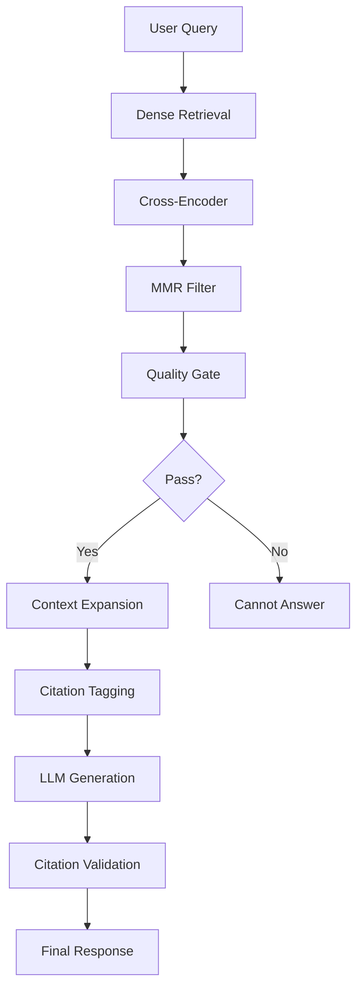

# 3GPP Release 17 RAG Chatbot

A Retrieval-Augmented Generation (RAG) chatbot for 3GPP Release 17 5G Core specifications. Ask technical questions about 3GPP standards and get grounded answers with proper citations.

---

## Features

- Semantic Search: Dense vector embeddings (Chroma) + BM25 retrieval from 1,980 3GPP specification chunks
- Cross-Encoder Reranking: Relevance scoring using MS-Marco cross-encoder
- Quality Gate: Evidence validation with configurable thresholds
- Context Expansion: Pulls adjacent sections for complete answers
- Citations: All responses include [S1], [S2] tags with source specs/sections/pages
- Persistent Storage: Chroma database on disk (survives restarts)
- Free LLM: Groq API (fast, high-quality, no cost)
- PDF Upload: Add new 3GPP specs via Streamlit UI
- No Docker: Everything runs locally in Python virtual environment

---

## Requirements

- Python 3.11+
- Virtual environment (myenv)
- 2GB+ disk space for embeddings + Chroma database
- Internet (for Groq API + HuggingFace model downloads)

---

## Quick Start

### 1. Clone & Setup

```bash
cd f:\Projects\mavenir
myenv\Scripts\activate.ps1
pip install -r requirements.txt
```

### 2. Configure API Key

Edit `.env`:
```
GROQ_API_KEY=your_groq_api_key_here
GROQ_MODEL=openai/gpt-oss-120b
MIN_RERANK_SCORE=0.5
```

Get free Groq API key: https://console.groq.com

### 3. Migrate Data to Chroma (First Time Only)

```bash
python migrate_qdrant_to_chroma.py
```

Output:
```
Loaded 1980 chunks from chunks.jsonl
Created Chroma collection: 3gpp_r17_5gcore
Total inserted: 1980 chunks
Chroma collection contains 1980 records
```

### 4. Start Backend

```bash
uvicorn src.api:app --port 8000 --reload
```

### 5. Start Frontend

In another terminal:
```bash
myenv\Scripts\activate.ps1
streamlit run main.py
```

Opens: http://localhost:8501

---

## System Architecture



### Pipeline Stages (Chroma-Based)

**1. Dense Retrieval (Chroma)** - 50ms
- Embed query with `all-MiniLM-L6-v2` (384-dim vectors)
- Cosine similarity search in Chroma persistent database (./chroma_data/)
- Returns: top 30 candidates with scores

**2. Cross-Encoder Reranking** - 500ms
- Score each (query, passage) pair with `ms-marco-MiniLM-L6-v2`
- Sort by relevance score (logits: -1 to +8 range)
- Returns: top 10 scored candidates

**3. MMR Diversity Filter** - 20ms
- Maximal Marginal Relevance algorithm
- Balance relevance vs diversity (prevent redundancy)
- Returns: top 7 diverse candidates

**4. Quality Gate Validation** - 5ms
- Check: `best_score >= 0.5` (cross-encoder threshold)
- Check: `candidate_count >= 2` (minimum evidence)
- Check: all have metadata (spec, section, page)
- If PASS -> continue; If FAIL -> return "Cannot Answer"

**5. Context Expansion** - 100ms
- For each candidate, find adjacent chunks
- Pull same/parent/child sections within same spec
- Word-cap evidence at 3,500 tokens

**6. Citation Tagging** - 10ms
- Build evidence string with [S1], [S2]... tags
- Format: [spec section - title (p.page)]

**7. LLM Generation** - 2-3s
- Call Groq API with `openai/gpt-oss-120b` model
- System prompt includes citation rules + source list
- Temperature: 0.0 (deterministic)
- Max tokens: 1024

**8. Citation Validation** - 50ms
- Parse [Sx] tags from LLM response
- Validate against source_map
- Auto-cite if LLM forgot citations
- Return final response

**Total Time: 3-4 seconds** end-to-end

---

## Project Structure

```
f:\Projects\mavenir\
├── README.md                 (Complete documentation)
├── .env.example              (Configuration template)
├── .gitignore                (Git ignore rules)
├── requirements.txt          (Python dependencies)
├── docker-compose.yml        (Optional Docker setup)
├── pyproject.toml            (Project metadata)
│
├── src/
│   ├── api.py               (FastAPI backend - port 8000)
│   ├── rag.py               (RAG pipeline orchestration)
│   │
│   ├── retrieval/           (Vector search & ranking)
│   │   ├── chroma_db.py     (Chroma client - persistent storage)
│   │   ├── dense_search_chroma.py  (Semantic search)
│   │   ├── reranker.py      (Cross-encoder scoring)
│   │   ├── mmr.py           (Diversity filtering)
│   │   ├── quality_gate.py  (Evidence validation)
│   │   ├── context_builder.py (Context expansion)
│   │   ├── hybrid.py        (Retrieval orchestration)
│   │   ├── bm25.py          (BM25 sparse retrieval)
│   │   └── embedder.py      (Embedding model)
│   │
│   ├── generation/          (LLM & citations)
│   │   ├── grok.py          (Groq API client)
│   │   └── citations.py     (Citation parsing & tagging)
│   │
│   ├── ingestion/           (PDF upload & processing)
│   │   ├── ingest.py        (Main pipeline - indexes to Chroma)
│   │   ├── parser.py        (PDF parsing with PyMuPDF)
│   │   ├── chunker.py       (Text chunking)
│   │   ├── upload_handler.py (Upload tracking)
│   │   └── validate_chunks.py (Chunk validation)
│   │
│   └── utils/
│       └── config.py        (Configuration from .env)
│
├── config/
│   └── settings.py          (Pydantic settings)
│
├── data/
│   ├── chunks.jsonl         (1,980 chunks - 3GPP corpus)
│   ├── embeddings.npy       (1980x384 embedding vectors)
│   ├── embedding_ids.json   (Chunk ID mapping)
│   └── pdfs/                (3GPP specification PDFs)
│
├── chroma_data/             (Persistent Chroma database)
│   └── 3gpp_r17_5gcore/     (Chroma collection)
│
├── main.py                  (Streamlit UI - port 8501)
├── app.py                   (FastAPI entry point)
├── setup_models.py          (Model download script)
├── migrate_qdrant_to_chroma.py (Data migration script)
└── tests/                   (Pytest test suite)
```

---

## Configuration

### `.env` File

```bash
# LLM Provider: Groq
GROQ_API_KEY=your_groq_key          # Get from https://console.groq.com
GROQ_BASE_URL=https://api.groq.com/openai/v1
GROQ_MODEL=openai/gpt-oss-120b      # Latest Groq model

# Retrieval
EMBEDDING_MODEL=sentence-transformers/all-MiniLM-L6-v2
RERANKER_MODEL=cross-encoder/ms-marco-MiniLM-L6-v2

# Quality Gate Thresholds
MIN_RERANK_SCORE=0.5                # Minimum cross-encoder score
MIN_EVIDENCE_COUNT=2                # Minimum chunks required

# Retrieval Tuning
MMR_TOP_K=7                         # Diversity-filtered candidates
```

---

## Performance Metrics

| Stage | Time | Output |
|-------|------|--------|
| Dense search (Chroma) | 50ms | 30 candidates |
| Reranking (cross-encoder) | 500ms | 10 scored candidates |
| MMR filtering | 20ms | 7 diverse candidates |
| Quality gate | 5ms | Pass/Reject decision |
| Context expansion | 100ms | Expanded chunks |
| Citation tagging | 10ms | Tagged evidence |
| LLM generation (Groq) | 2-3s | Final answer |
| Citation validation | 50ms | Cited response |
| **Total** | **3-4s** | **Cited answer** |

---

## Testing

Run all tests:
```bash
pytest tests/ -v
```

Test specific module:
```bash
pytest tests/test_rag.py -v -k "test_answer_question"
```

Key test files:
- `test_rag.py` - Full pipeline
- `test_chroma_db.py` - Chroma retrieval
- `test_quality_gate.py` - Evidence validation
- `test_citations.py` - Citation parsing

---

## Adding New PDFs

### Via Streamlit UI
1. Click "Upload PDF" in Streamlit
2. Select 3GPP PDF (up to 200MB)
3. Wait for: Parsing -> Chunking -> Embedding -> Indexing to Chroma
4. Query immediately (data auto-added to Chroma)

### Via CLI
```bash
python -m src.ingestion.ingest <path_to_pdf>
```

Processing time: 30-60 min per 100 pages (CPU embedding)
For faster embedding: Use Google Colab with CUDA GPU

---

## Usage Examples

### Via API
```bash
curl -X POST http://localhost:8000/ask \
  -H "Content-Type: application/json" \
  -d '{"question": "What is the role of the AMF in 5G core network?"}'
```

Response:
```json
{
  "answer": "The Access and Mobility Management Function (AMF)...",
  "sources": [
    {
      "id": "S1",
      "spec": "23.501",
      "section": "6.1.1",
      "page": 42,
      "text": "..."
    }
  ],
  "supported": true
}
```

### Via Streamlit UI
1. Open http://localhost:8501
2. Type question in input box
3. Click "Ask"
4. See answer + expandable source sections

---

## Troubleshooting

### "I cannot reliably answer"
- **Cause**: Quality gate rejected evidence (score < 0.5 or < 2 chunks)
- **Fix**: Lower `MIN_RERANK_SCORE` in `.env` to 0.3
- **Debug**: Run `python diagnose_query.py` to see rerank scores

### No sources found
- **Cause**: Chroma database empty or not started
- **Fix**: Re-run `python migrate_qdrant_to_chroma.py`
- **Check**: `python -c "from src.retrieval.chroma_db import get_collection; print(get_collection().count())"`

### Slow embedding on PDF upload
- **Cause**: CPU-based embedding (all-MiniLM-L6-v2 is 6M params)
- **Fix**: Use Google Colab for GPU acceleration (5x faster)
- **Time**: 30 min per 100 pages on CPU

### Groq API rate limit
- **Cause**: Free tier has limits (30 requests/min)
- **Fix**: Wait 1 minute or upgrade plan
- **Status**: Check https://console.groq.com

---

## Key Components

### Dense Search (Chroma)
- Semantic vector search from Chroma persistent database (./chroma_data/)
- Returns top 30 candidates by cosine similarity
- Embeddings: all-MiniLM-L6-v2 (384-dim, fast)

### Cross-Encoder Reranking
- MS-Marco trained cross-encoder (22M params)
- Scores (query, passage) relevance: -1 to +8 range
- Returns top 10 with scores

### MMR Diversity Filter
- Maximal Marginal Relevance balances relevance + diversity
- Prevents redundant evidence
- Returns top 7 candidates

### Quality Gate
- Validates evidence sufficiency
- Checks: score >= MIN_RERANK_SCORE (0.5) AND count >= 2
- Rejects low-confidence evidence before LLM

### Context Expansion
- Finds adjacent chunks in same section
- Expands context by +/- 1 neighbor per side
- Improves answer coherence

### Citation System
- LLM generates answers with [S1], [S2]... tags
- Fallback: Auto-inserts tags if LLM forgets
- Validation: Checks citations against source_map

---

## Security Notes

- **API Key**: Groq API key in `.env` (never commit to git)
- **Local Processing**: Embeddings + reranking run locally (only LLM call goes to Groq)
- **Database**: Chroma data in `./chroma_data/` (persistent, local)
- **No auth**: Streamlit UI is open (use behind reverse proxy in production)

---

## License

Project for Mavenir. 3GPP specifications are proprietary.

---

## Support

For issues:
1. Check troubleshooting section above
2. Review debug logs in terminal
3. Inspect `.env` configuration
4. Check Chroma data: `python migrate_qdrant_to_chroma.py --verify`

---

## Data Summary

| Metric | Value |
|--------|-------|
| Total chunks | 1,980 |
| Specs included | TS 23.501, TS 23.502, TS 23.503 (3GPP Release 17) |
| Embedding dimension | 384 (all-MiniLM-L6-v2) |
| Database engine | Chroma (DuckDB + Parquet, persistent) |
| Storage location | `./chroma_data/` (survives restarts) |
| Query response time | 3-4 seconds |

---

## Future Enhancements

- [ ] Web UI authentication (FastAPI + JWT)
- [ ] GPU acceleration for embeddings
- [ ] Multi-spec search (R16, R15, etc.)
- [ ] Conversation history/multi-turn QA
- [ ] Batch processing API
- [ ] Response caching for common questions
